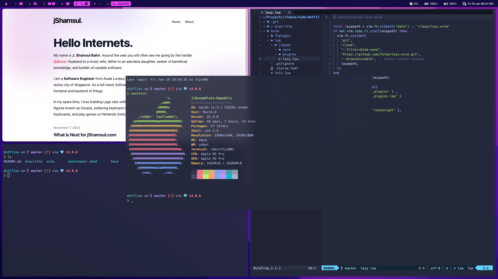

<h1 align="center">.Dotfiles.</h1>

    

## Hello Internets,

My name is [J.Shamsul](https://jshamsul.com), and around the web I am known with my handle Jibone (X:[@jibone](https://twitter.com/jibone)). This is my dotfiles repo.

I would advise against using these dotfiles directly. It is specifically tailored to my taste and I have no plans in supporting it, if you ran into some issues when using these configurations directly.

Please only use this as reference. If you find any of the configurations useful, give me a shoutout over on X:[@jibone](https://twitter.com/jibone)

## Hardware.

My main machine is a **M2 MacBook Pro**, and this configuration is for MacOSX versions of the applications. If I were to someday have multiple machine that I worked on, maybe I’ll split up this config files.

## Software

Here are some of the software I use and their respective configuration

**Alacritty**  
I work on the terminal most of the time, and my go-to terminal currently is [Alacritty](https://alacritty.org). Its configuration can be found here: [alacritty/alacritty.toml](https://github.com/jibone/dotfiles/blob/master/alacritty/alacritty.toml)

**NeoVim**  
My main editor is NeoVim. I use Lazy.nvim to manage my plugin. My [NeoVim](https://neovim.io) settings are here: [nvim/](https://github.com/jibone/dotfiles/tree/master/nvim)

**Tmux**  
When working in the terminal, I use [Tmux](https://github.com/tmux/tmux/wiki) to split and manage terminal panes. My settings for Tmux are here: [tmux/tmux.conf](https://github.com/jibone/dotfiles/blob/master/tmux/tmux.conf)

**Yabai**  
I use a window tiling manage called [Yabai](https://github.com/koekeishiya/yabai). I love how it just organises all my open windows. My configuration for Yabai is here: [yabai/yabairc](https://github.com/jibone/dotfiles/blob/master/yabai/yabairc)

**Skhd**  
Together with Yabai I use [Skhd](https://github.com/koekeishiya/yabai) to configure my keyboard shortcuts. My settings can be found here: [skhd/skhdrc](https://github.com/jibone/dotfiles/blob/master/skhd/skhdrc)

**Sketchybar**  
I am not sure how useful this is, but I love how the [Sketchybar](https://felixkratz.github.io/SketchyBar/) looks. The configuration for sketchybar can be found here: [sketchybar/](https://github.com/jibone/dotfiles/tree/master/sketchybar)

## Resource.

While working on setting up my configurations, I had a lot of inspiration from these Youtubers. Their videos helped me a lot while I was tweaking and configuring my setup.

**Josean Martinez**  
YT: [@joseanmartinez](https://www.youtube.com/@joseanmartinez)  
Web: [josean.com](https://www.josean.com)

**Takuya Matsuyama**  
YT: [@devaslife](https://www.youtube.com/@devaslife)  
Web: [craftz.dog](https://www.craftz.dog)

**Christian Chiarulli**  
YT: [@chrisatmachine](https://www.youtube.com/@chrisatmachine)  
Web: [chrisatmachine.com](https://www.chrisatmachine.com)

I suggest you check them out if you are interested in customising your NeoVim, Shell, and other Terminal goodies.
